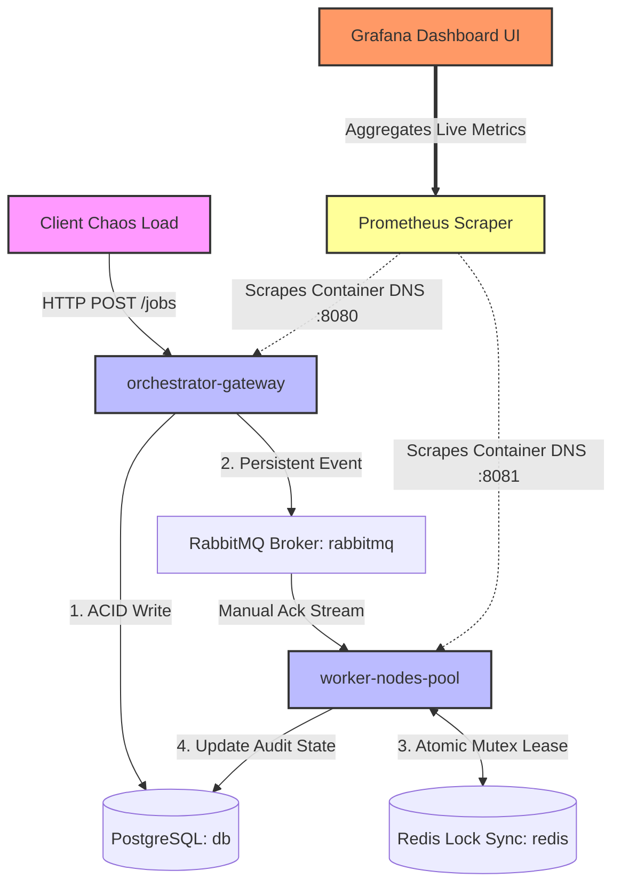

# Distributed Job Orchestrator (Fault-Tolerant Engine)

A production-grade, highly resilient distributed task orchestration engine built in Go. Engineered to guarantee absolute execution correctness under heavy network load, worker crashes, database saturation, and duplicate message delivery.

## Architecture Design & Topology

The platform uses a decoupled design, keeping the ingestion API gateway strictly separated from state machine execution workers using a durable message backbone and fast global locking primitives. All components are fully containerized and run on an isolated Docker network overlay to mimic real-world cloud VPC conditions.



## Key Resilience Primitives

* **Atomic Ingestion State Integrity:** To protect against untracked messages or state mismatch issues, the API uses a strict transactional ordering rule: The database tracking row must commit successfully before a message hits the wire. If PostgreSQL drops offline, incoming requests are safely rejected with an HTTP 500 Internal Server Error, ensuring no data circulates without an audit trail.
* **Distributed Fencing & Lease Recovery:** If a worker node crashes mid-job while holding a `RUNNING` status record, RabbitMQ's manual acknowledgment fallback immediately places the message back in the queue. When a surviving worker node consumes the message, it assesses the original `updated_at` lease window. If the lease is stale (older than 30 seconds), it forcefully takes over execution, fences out the dead worker context, and safely finishes processing.
* **Native Broker Backoff Arrays:** Instead of utilizing unsafe, application-level memory timers (`time.After`) which risk losing data if a container restarts, delayed retries are pushed onto a dedicated `jobs.retry` topology utilizing native message Time-To-Live (TTL) arrays and Dead Letter Exchanges (DLX). The retry delay sits safely on disk inside RabbitMQ.

## Telemetry & System Observability

The platform features built-in Prometheus instrumentation tracking transaction metrics in real time, alongside live Grafana dashboards monitoring system performance under active chaos load.

### Production Scraped Metrics
* `orchestrator_jobs_ingested_total`: Ingress volume tracking counter (tracked by job name, e.g., `video.transcode`, `fail.me`).
* `worker_redis_lock_failures_total`: Tracks lock collisions to highlight cluster distribution imbalances.

### Live Architecture Telemetry

#### 1. Prometheus Target Scraper Grid
Both the core orchestration engine and the worker pools expose metric endpoints that are continuously scraped. All core systems consistently report a stable, healthy `UP` state inside the isolated container layer.


#### 2. Real-Time Moving Ingestion Rates
The dashboard captures production traffic spikes under automated chaos testing. It visualizes moving execution velocities, cleanly capturing real-time comparisons between successful pipelines (`video.transcode`) and injected structural errors (`fail.me`).


### Asynchronous Messaging Backbone & Fault Isolation

The architecture utilizes a robust three-tier RabbitMQ topology to isolate system processing bottlenecks and handle task execution backoffs securely.

#### 1. Queue State Registers & Transaction Fencing
The broker queue footprint highlights our manual acknowledgment protocol in action. Tasks inside the `jobs.execution` pipeline stay in an `Unacked` state while processing, ensuring zero-drop reliability if an active container goes down. The `DLX` and `DLK` features on `jobs.retry` handle transactional retries safely on disk.


#### 2. Real-Time Message Processing Velocities
The broker overview tracks active input/output streams under heavy stress testing. It visualizes consistent processing consumption rates (`0.40/s` consumer ACKs) alongside balanced message disk writes, proving the messaging pipeline handles heavy load without thread starvation or memory leaks.


## Local Verification & Production Deployment

Because the entire infrastructure matrix is completely containerized, you can initialize the database tables, message brokers, application binaries, and Prometheus monitoring scrapers using a single unified command:

### 1. Boot up the Entire Stack
```bash
cd deployments
```
```
docker-compose up --build -d
```
### 2. Verify Container Health
Ensure all engines are operational and bound to the bridge network:

```Bash
docker-compose ps
```
### 3. Inject Automated Chaos and Load Tests
Execute the traffic generator script locally to stream workloads and simulated system failures into the ingestion cluster:

```Bash
cd ..
```
```
go run internal/chaos/runner.go
```
### 4. Access the Observability Hubs
Prometheus Expression Browser: http://localhost:9090

Grafana Dashboards: http://localhost:3000
