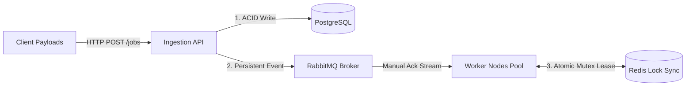

# Distributed Job Orchestrator (Fault-Tolerant Engine)

A production-grade, highly resilient distributed task orchestration blueprint built in Go. Engineered to guarantee absolute execution correctness under heavy network load, worker crashes, database saturation, and duplicate message delivery.

## Architecture Design & Topology

The platform uses a decoupled design, keeping the ingestion API gateway strictly separated from state machine execution workers using a durable message backbone and fast global locking primitives.


## Key Resilience Primitives
1. **Atomic Ingestion State Integrity**
To protect against untracked messages or state mismatch issues, the API uses a strict transactional ordering rule: The database tracking row must commit successfully before a message hits the wire. If PostgreSQL drops offline, incoming requests are safely rejected with an HTTP 500 Internal Server Error, ensuring no data circulates without an audit trail.

2. **Distributed Fencing & Lease Recovery**
If a worker node crashes mid-job while holding a RUNNING status record, RabbitMQ's manual acknowledgment fallback immediately places the message back in the queue.

When a surviving worker node consumes the message, it assesses the original updated_at lease window. If the lease is stale (older than 30 seconds), it forcefully takes over execution, fences out the dead worker context, and safely finishes processing.

3. **Native Broker Backoff Arrays**
Instead of utilizing unsafe, application-level memory timers (time.After) which risk losing data if a container restarts, delayed retries are pushed onto a dedicated jobs.retry topology utilizing native message Time-To-Live (TTL) arrays and Dead Letter Exchanges (DLX). The retry delay sits safely on disk inside RabbitMQ.

## Live Prometheus Telemetry Targets
**orchestrator_jobs_ingested_total**: Ingress volume tracking counter.

**worker_job_execution_duration_seconds**: Histogram tracking exact task execution time distributions.

**worker_redis_lock_failures_total**: Tracks lock collisions to highlight cluster distribution imbalances.

## Local Verification & Development
1. Boot up the Storage and Messaging Backbones
```
docker-compose -f deployments/docker-compose.yml up -d
```
3. Launch the Orchestrator Service (Port 8080)
```
go run cmd/orchestrator/main.go
```
4. Launch the Worker Node Pool (Port 8081 Scraper)
```
go run cmd/worker/main.go
```
5. Inject Automated Chaos and Load Tests
```
go run internal/chaos/runner.go
```
