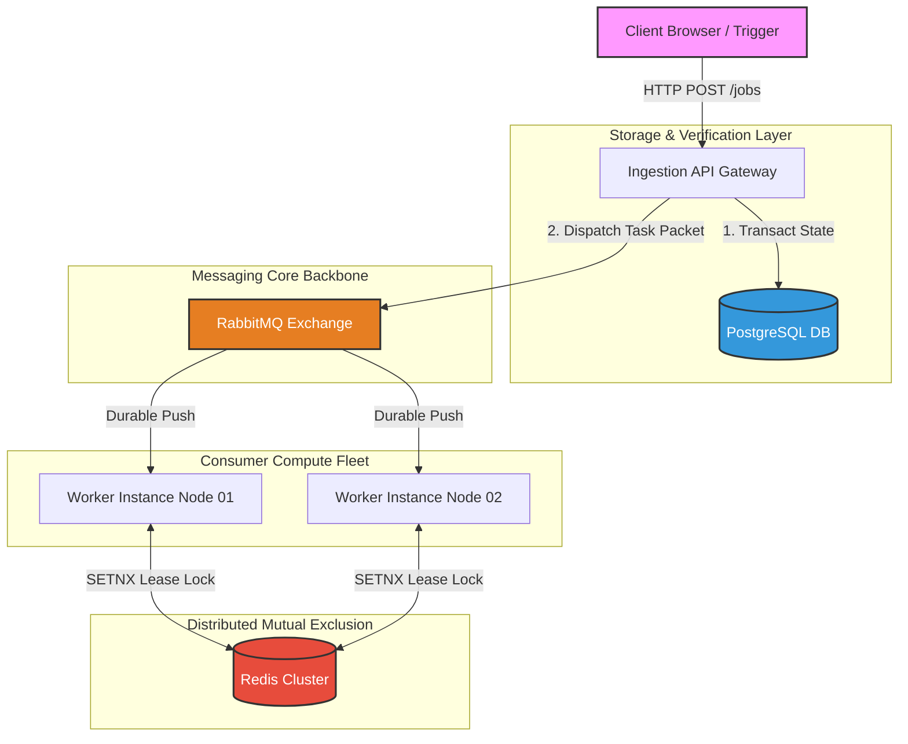

# Distributed System Architecture Blueprint

This document details the component mapping topology and processing state machinery of the Distributed Job Orchestrator.

## Component Block Architecture

The orchestration engine leverages decoupled state, synchronization, and event distribution paths to assure high reliability:

* **API Gateway Ingestion Layer (Go):** Validates incoming JSON configurations, records a persistent baseline into storage, and drops messages onto the streaming backbone.
* **Message Broker (RabbitMQ Engine):** Configured with persistent channels and classic durable queues to prevent in-flight buffer dropouts.
* **Coordination State Register (PostgreSQL):** Standard database acting as the single source of truth for transactional lifecycle changes.
* **Mutual Exclusion Boundary (Redis Cache):** High-throughput lookup engine preventing race-conditions or overlapping worker polling cycles.

## Job State Machine Flow Transitions

```text
  [Inbound Client POST]
            │
            ▼
     ┌─────────────┐
     │   PENDING   │ ──► Saved to DB, Enqueued to AMQP protocol wire
     └─────────────┘
            │
            ▼ (Acquired by worker instance node, Mutex lock claimed)
     ┌─────────────┐
     │   RUNNING   │ ──► Heartbeat lease initialized (updated_at tracking)
     └─────────────┘
       ├── Extinction / Success  ──► [STATUS: SUCCESS] (Ack dispatched)
       └── Fatal Crash scenario ──► [STATUS: PENDING] (Lease expires -> Fencing Takeover)
            │
            ▼ (Execution exception caught)
     ┌─────────────┐
     │   RETRY     │ ──► Calculated via Backoff formula ($2^{retry} \times 1000\text{ms}$)
     └─────────────┘
       └── Threshold exceeded ──► [STATUS: DEAD] (Routed directly to jobs.dlq buffer)
```
# Architectural Specification & Topology Blueprint

This document details the layout, data validation patterns, and communication boundaries of the Distributed Job Orchestrator system.

## System Topology Block


